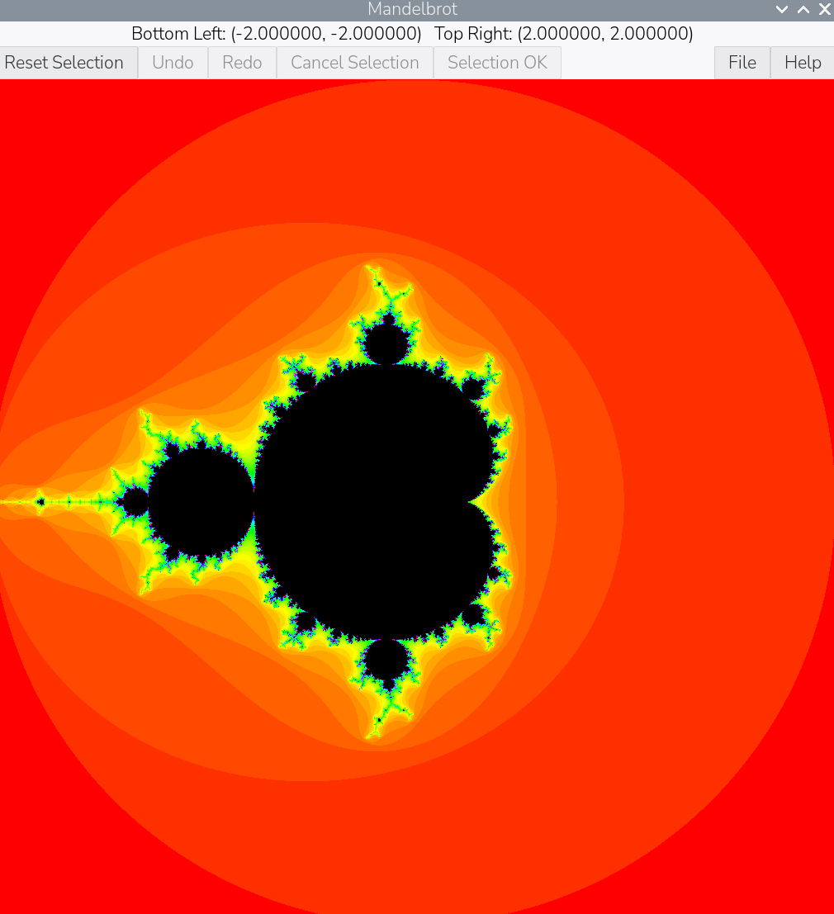

# Mandelbrot

A GtkAda GUI for exploring the Mandelbrot set, written in Ada.



## Features

- Renders a 1024x1024 Mandelbrot set into a `Display_Buffer`, computed
  across four parallel Ada tasks, coloured with a vivid hue-wheel palette
  (the point that never escapes is shown black).
- Displays the complex-plane coordinates of the current view's corners.
- Drag the left mouse button over the image to select a square region.
  The selection stays on screen until confirmed or discarded:
  - **Selection OK** — zoom into the selected area.
  - **Cancel Selection** — discard the selection.
  - **Reset Selection** — return to the full initial view.
  - **Undo** / **Redo** — step backward/forward through the full history
    of views (both Reset Selection and Selection OK add an entry).
- **Help** button describing all of the above, plus the build date.
- "Save as PNG..." writes the currently displayed image to a PNG file,
  embedding the corner coordinates as `tEXt` metadata chunks.

## Requirements

- [Alire](https://alire.ada.dev/) (`alr`), which resolves and builds the
  GNAT toolchain and the GtkAda dependency.
- GTK+3 development libraries available to `pkg-config` (e.g. the
  `libgtk-3-dev` package on Debian/Ubuntu).

## Building

```sh
alr build
```

## Running

```sh
alr run
```

or directly:

```sh
bin/mandelbrot
```

## Project layout

- `src/mandelbrot.adb` — entry point; delegates to `Mandelbrot_GUI.Run`.
- `src/calculation_engine.ads` / `.adb` — Mandelbrot set generation, run
  across four persistent Ada tasks.
- `src/mandelbrot_gui.ads` / `.adb` — the GUI: colour palette, Cairo
  rendering, mouse-driven selection and its confirmation buttons, the
  Help dialog, and PNG export.

## License

GPL-3.0. See [LICENSE](LICENSE).
